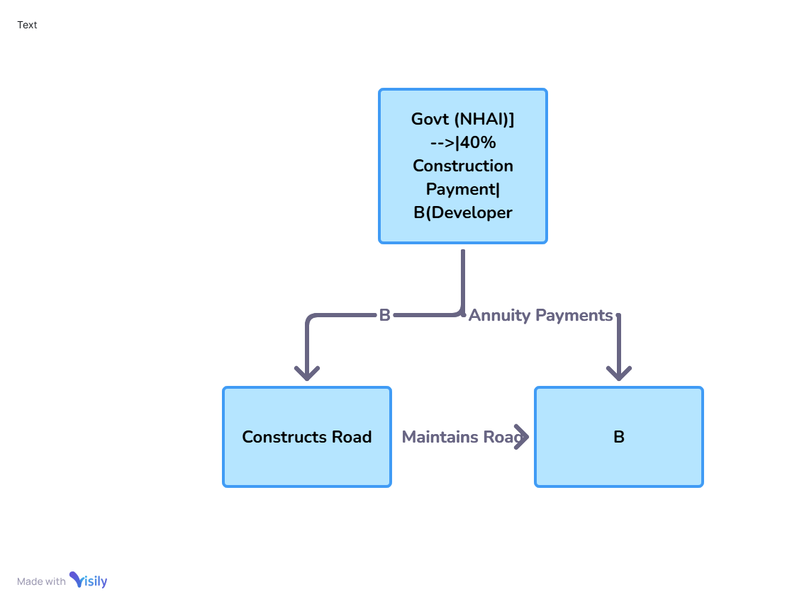

# The Future of Hybrid Annuity Model (HAM) in Indian Road Projects

## 1. Introduction

The **Hybrid Annuity Model (HAM)** blends EPC and BOT models, promoting balanced risk-sharing between government and private developers in Indian road infrastructure.

### Why It Matters
- Vital for India’s massive road network and economic goals.
- Supports Bharatmala and PM Gati Shakti programs.

### Target Audience
- Infrastructure developers
- Policy makers & planners
- Investors & financiers
- Project managers & consultants

---

## 2. Key Terms

- **HAM**: Govt pays 40%, private sector 60% (annuity paid over time)
- **EPC**: Government-funded & owned
- **BOT**: Developer-financed, operated & transferred
- **NHAI**: National Highways Authority of India
- **Annuity**: Regular payments made to developers
- **VGF**: Govt support to make projects viable

---

## 3. How HAM Works

- Govt pays **40%** during construction in 5 milestones.
- Developer funds **60%**, repaid via **semi-annual annuity** (15–20 years).
- Govt pays O&M and interest on invested amount.

### Risk Split

| Stakeholder       | Responsibility                           |
|-------------------|-------------------------------------------|
| Govt (NHAI)       | 40% funding, clearances, land acquisition |
| Developer         | 60% investment, construction, maintenance |
| Lenders           | Fund developer's share                    |

---

## 4. Project Lifecycle

1. **Planning**  
   - DPR, clearances  
2. **Bidding**  
   - RFP, lowest cost wins  
3. **Financial Closure**  
   - Developer arranges loans  
4. **Construction**  
   - 5 milestone-based payments  
5. **O&M Phase**  
   - Govt pays annuity & performance-based O&M  
6. **Monitoring**  
   - Third-party audits  

---

## 5. Best Practices

- Use **performance-based contracts**
- Track milestones digitally (IoT/GIS)
- Create **escrow/annuity reserves**
- Mandate **quality checks** and audits

---

## 6. Common Issues

| Issue                   | Cause                  | Solution                            |
|------------------------|------------------------|-------------------------------------|
| Land delays            | Bureaucracy            | Pre-bid clearances                  |
| Payment delays         | Budget issues          | Escrow/annuity reserves             |
| Poor construction      | Low-quality work       | Strict QC & penalties               |
| Low bid viability      | Underquoting           | Floor bid criteria                  |
| Funding gaps           | Govt credit risk       | Guarantees/insurance wraps         |

---

## 7. References

- [NHAI](https://nhai.gov.in)
- Bharatmala Pariyojana
- MoRTH Reports
- CRISIL Infra Research
- Economic Survey of India

---

## 8. Appendix

###  HAM Project Timeline

| Phase              | Duration (Months) |
|-------------------|-------------------|
| DPR & Clearances  | 6                 |
| Bidding           | 3                 |
| Financial Closure | 2                 |
| Construction      | 24                |
| O&M               | 15 years          |

###  Interest Rate Example

- Base (RBI 10Y G-Sec): 6.5%  
- Margin: 3.0%  
- Effective Interest: **9.5%**

---

## Financial Flow

{ width="400px" style="border: 1px solid #ccc; border-radius: 8px;"}
